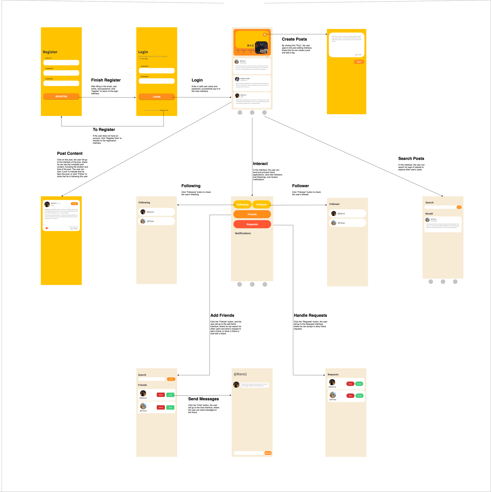
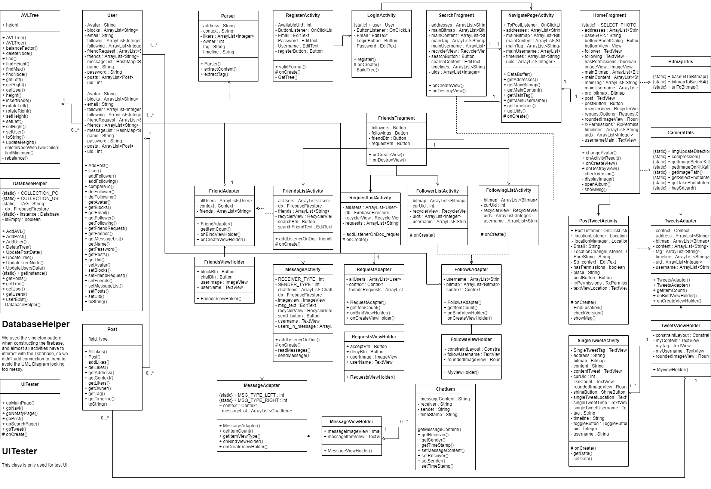

# Godzilla Report

The following is a report template to help your team successfully provide all the details necessary for your report in a structured and organised manner. Please give a straightforward and concise report that best demonstrates your project. Note that a good report will give a better impression of your project to the reviewers.

*Here are some tips to write a good report:*

* *Try to summarise and list the `bullet points` of your project as much as possible rather than give long, tedious paragraphs that mix up everything together.*

* *Try to create `diagrams` instead of text descriptions, which are more straightforward and explanatory.*

* *Try to make your report `well structured`, which is easier for the reviewers to capture the necessary information.*

*We give instructions enclosed in square brackets [...] and examples for each sections to demonstrate what are expected for your project report.*

*Please remove the instructions or examples in `italic` in your final report.*

## Table of Contents

1. [Team Members and Roles](#team-members-and-roles)
2. [Conflict Resolution Protocol](#conflict-resolution-protocol)
2. [Application Description](#application-description)
3. [Application UML](#application-uml)
3. [Application Design and Decisions](#application-design-and-decisions)
4. [Summary of Known Errors and Bugs](#summary-of-known-errors-and-bugs)
5. [Testing Summary](#testing-summary)
6. [Implemented Features](#implemented-features)
7. [Team Meetings](#team-meetings)

## Team Members and Roles

| UID | Name | Role |
| :--- | :----: | ---: |
| u7270388 | Bofeng Chen | Front-End |
| u6988392 | Jiawei Li | Back-End  |
| u7344258 | Isaac Zhang | Back-End  |
| u7237845 | Yufeng Pan | Front-End  |
### Bofeng Chen u7270388
* Contributed to project task planning
* Contributed to the UI storyboard
* Contributed to UI drawing
* Contributed to defining user stories
* Contributed to the UML diagram design

### Jiawei Li u6988392
* Contributed to project task planning
* Contributed to the DataStructure design
* Contributed to Real-time Chatting
* Contributed to defining user stories
* Contributed to the UML diagram design

### Isaac Zhang u7344258
* Contributed to project task planning
* Contributed to the DataBase building
* Contributed to the DataStructure design
* Contributed to defining user stories
* Contributed to the wiki pages
* Contributed to the glossary

### Yufeng Pan u7237845
* Contributed to the GPS activity
* Contributed to the use cases
* Contributed to project task planning
* Contributed to defining user stories
* Contributed to the wiki pages
## Conflict Resolution Protocol

*[Write a well defined protocol your team can use to handle conflicts. That is, if your group has problems, what is the procedure for reaching consensus or solving a problem? (If you choose to make this an external document, link to it here)]*

* We pursue democracy in our group. If we have different opinions, we will have a vote to determine a task. Other than that, we always keep humble and show respects to each other.  
## Application Description

* Micro-Chat is a social media application specifically targeting Z-generations who love minimalism. It provides a great platform to sharing live conditions. Furthermore, Users are able to find interesting posts and add the poster to be friend.

**Here is a Micro-Chat application example**

* People want to find friends or something interesting / People want to have a private chat with friends
  1. Isaac is bored, and he decides to find something he likes. 
  2. he searches post about Pokémon with the tag #Bulbasaur.
  3. Ken, a freshman in university, posted "Bulbasaur (Scientific Analysis)" before.
  4. Isaac finds this post and presses the like button because he feels the author should be funny.
  5. He finds Ken by Uid search, send a friend request then.
  6. Ken accepts request and has chat with Isaac.
  7. They are friends now!

* Targets Users: The love of contemporary young people who practice minimalism
  * Users can change their profile to have a unique avatar.
  * Users can use log in to my account simply and securely.
  * Users can use easily access my historical posts between devices.
  * Users can use APP offline and all data will be uploaded once connected to the Internet.
  * Users can use it to chat with accepted friends.
  * Users can post their living conditions with/without locations.
  * Users can see other's posts and find they are interested users.
  * Users can block hated users to refuse see their posts and messages.
  * Users can do search on tag/post/email/uid.

*List all the use cases in text descriptions or create use case diagrams. Please refer to https://www.visual-paradigm.com/guide/uml-unified-modeling-language/what-is-use-case-diagram/ for use case diagram.*

## Application UML

*[Replace the above with a class diagram. You can look at how we have linked an image here as an example of how you can do it too.]*

## Application Design and Decisions

[Firebase](#firebase)

[User Profile](#user-profile)

[Location](#location)

[Micro-Interaction](#micro-interaction)

[Messaging](#messaging)

---

### Firebase

| ID | User Need | Rationale | Story Points | Risk Level | Status |
| ------ | ------ | ------ | ------ | ------ | ------ |
| US 01.01.01 | As a user, I want to log in to my account simply and securely. | The user uses the email address and password to log in to the account on the login interface. If there is no account, click "Register Now" in the lower right corner to jump to the registration interface to register. | 3 | Low | Done |
| US 01.02.01 | As a user, I want to easily access my historical posts between devices. | After the user posts a post on one device, the data will be uploaded to Firebase. If the user logs in to his account on another device, the user can still access historical posts. | 5 | Medium | Done |

 
 
 

### User Profile

| ID | User Need | Rationale | Story Points | Risk Level | Status |
| ------ | ------ | ------ | ------ | ------ | ------ |
| US 02.01.01 | As a user, I want my user profile to have a unique avatar. | When the user successfully logs in to the main page, a pop-up window will ask the user whether to allow app access photos, media, and files on the device. The user clicks "Allow", then clicks the avatar in the main page, and selects "Album" from the options below, finally the user can choose a picture in the album as the avatar. | 3 | Low | Done |

 
 
 

### Location

| ID | User Need | Rationale | Story Points | Risk Level | Status |
| ------ | ------ | ------ | ------ | ------ | ------ |
| US 03.01.01 | As a user, I want to include my real-time geographic location in my posts. | When the user clicks the post button on the main page, the app switches to the post tweet page. A window will pop up asking whether to allow the app to access the device's location. If the user clicks "Allow", then click the location text box in the lower right corner to update the real-time location. | 3 | Low | Done |

 
 
 

### Micro-Interaction

| ID | User Need | Rationale | Story Points | Risk Level | Status |
| ------ | ------ | ------ | ------ | ------ | ------ |
| US 04.01.01 | As a user, I want to interact with the posts of other users, and express my appreciation for some posts. | The user can see the posts of the user he is following on the main page, and click on a post to go to the interface of the post, where the user can click on the "love" in the lower left corner to express appreciation. | 3 | Low | Done |

 
 
 

### Messaging

| ID | User Need | Rationale | Story Points | Risk Level | Status |
| ------ | ------ | ------ | ------ | ------ | ------ |
| US 05.01.01 | As a user, I want to perform peer to peer messaging with my friends. | When the user clicks "FRIENDS" on the interactive interface, you can enter the "Add Friend" interface, where the user can click the "Chat" button of a friend from the friend list to enter the message interface to send and receive friends' messages. | 8 | High | Done |
| US 05.02.01 | As a user, I want to block messages sent by certain users. | When the user clicks "FRIENDS" on the interactive interface, you can enter the "Add Friend" interface, where the user can click the "Block" button of a friend from the friend list to block the messages sent by the friend. | 5 | Medium | Done |

 
 
 

*Please give clear and concise descriptions for each subsections of this part. It would be better to list all the concrete items for each subsection and give no more than `5` concise, crucial reasons of your design. Here is an example for the subsection `Data Structures`:*

*I used the following data structures in my project:*

AVLTree
* Objective: It is used for storing User information for DataBase feature.

* Locations: line 5 to 244 in AVLTree.java.

* Reasons:
  * It is efficient for insertion/deleting/searching with a time complexity O(nlogn)

  * Each tree node can store an object which presents a user
     
  * Can quickly update users data by its structure

HashSet
* Objective: It is used for storing Likers on each post

* Locations: line 16 in Post.java.

* Reasons: A user can only add like once for each post, HashMap can avoid repeat likes

ArrayList
* Objective: It is used for storing generic type

* Locations: line 14 in User.java.

* Reasons: A user can have multiple posts and the Arraylist can take generic type which is our Post Class
      
**Data Structures**

AVLTree
 
We use it to store our database. And we used it everywhere once we need to retrieve data from our DataBase. For instance, When users want to search a post / a user;
when a new User signup , find a different uid to him/her, etc.
    

**Design Patterns** 

Singleton Pattern: Because singleton prevents other objects from instantiating their own copies of the Singleton object, ensuring that all objects access the single instance.
And We want to make sure each user has only one instance to interact with our database. otherwise, it could be messed up.

Factory Pattern:  Factory Method Pattern allows the sub-classes to choose the type of objects to create while having multiple different Object Classes like Post/User/Friend. 
It is unsafe to export outside and also requires repeat creating operations.
However, we can create a new Object by its class using the basically same command; Factory Pattern will know what kind of object we want then.

**Grammars**

*Search Engine*
*[How do you design the grammar? What are the advantages of your designs?]*
 
 * We design user can search different stuff by the same search engine. So User can search either other user or Posts (whether this post belong to themselves or others).
   * Production Rules*
   * "@" ::= User
   * "User" :: = Username | Uid | EmailAddress
   * "Username" :: =  Username | Null
   * "Uid" :: =  Uid | Null
   * "EmailAddress" :: = EmailAddress | Null
   * "#" :: = Post
   * "Post" :: = Tag | Content
   * Tag :: = Tag | Empty String

**Tokenizer and Parsers**
*[Where do you use tokenisers and parsers? How are they built? What are the advantages of the designs?]*

* We apply Tokenizer and Parsers on post activity. It will automatically generate Tag and content. Basically,
Users can input any context into our Database, and our tokenizer will tokenize each word (which is split by indentation).
Then our parsers will parse this post by each token to extract Tag and also take that out to make content.

**Regular Expression**
*[What other design decisions have you made which you feel are relevant? Feel free to separate these into their own subheadings.]*
 * We restricted new users who want to register a new account by invalid email address.

## Summary of Known Errors and Bugs 

*[Where are the known errors and bugs? What consequences might they lead to?]*

1. Bug 1:

- Do asynchronous operation super quickly might crash the application.

*List all the known errors and bugs here. If we find bugs/errors that your team do not know of, it shows that your testing is not through.*

## Testing Summary 

*[What features have you tested? What is your testing coverage?]*

*Here is an example:*

*Number of test cases: ...*

*Code coverage: ...*

*Types of tests created: ...*

*Please provide some screenshots of your testing summary, showing the achieved testing coverage. Feel free to provide further details on your tests.*

## Implemented Features

*[What features have you implemented?]*

###Basic APP
* Users must be able to login (not necessarily sign up).
* Users must be able to load (from file(s) or Firebase) and view posts (e.g. on a timeline activity).
* Users must be able to search for posts by tags (e.g. #COMP2100isTheBest). The search functionality must make use of a tokenizer and parser with a grammar of your own creation.
* There must be a data file with at least 1,000 valid data instances.  To run this feature, please run DataStreamActivity.java singly.

###Improved Search
* Search functionality can handle partially valid and invalid search queries. (medium)

###Greater Data Usage, Handling and Sophistication
* User profile activity containing a media file (image, animation (e.g. gif), video). (easy)
* Use GPS information (see the demo presented by our tutors. For example, your app may use the latitude/longitude to show posts). (easy)
* Deletion method of either a Red-Black Tree and or AVL tree data structure. The deletion of nodes must serve a purpose within your application (e.g. deleting posts). (hard) (Implemented but never used)

###User Interactivity
* The ability to micro-interact with 'posts' (e.g. like, report, etc.). (easy)

###User Privacy
* Friendship. Users may send friend requests which are then accepted or denied. (easy)

###Peer to Peer Messaging
* Provide users with the ability to message each other directly. (hard)
* Privacy I: provide users with the ability to ‘block’ users. Preventing them from directly messaging them. (medium)

###Firebase Integration
* Use Firebase to implement user Authentication/Authorisation. (easy)
* Use Firebase to persist all data used in your app (this item replace the requirement to retrieve data from a local file) (medium)
* Using Firebase or another remote database to store user posts and having a user’s timeline update as the remote database is updated without restarting the application. E.g. User A makes a post, user B on a separate instance of the application sees user A’s post appear on their timeline without restarting their application. (very hard)

*List all features you have completed in their separate categories with their difficulty classification. If they are features that are suggested and approved, please state this somewhere as well.*

## Team Meetings

*Here is an example:*

- *[Team Meeting 1](./reportResource/Meeting 1.md)*
- *[Team Meeting 2](./reportResource/Meeting 2.md)*
- *[Team Meeting 3](./reportResource/Meeting 3.md)*

*Either write your meeting minutes here or link to documents that contain them. There must be at least 3 team meetings.*
